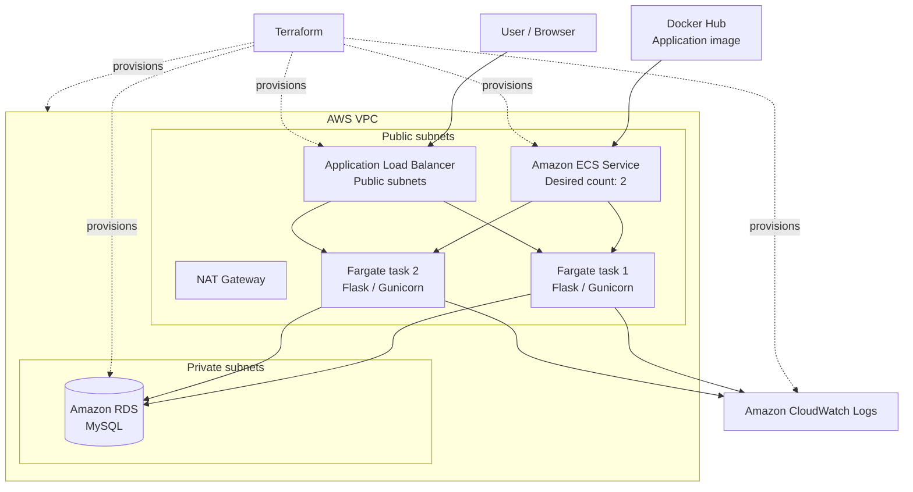
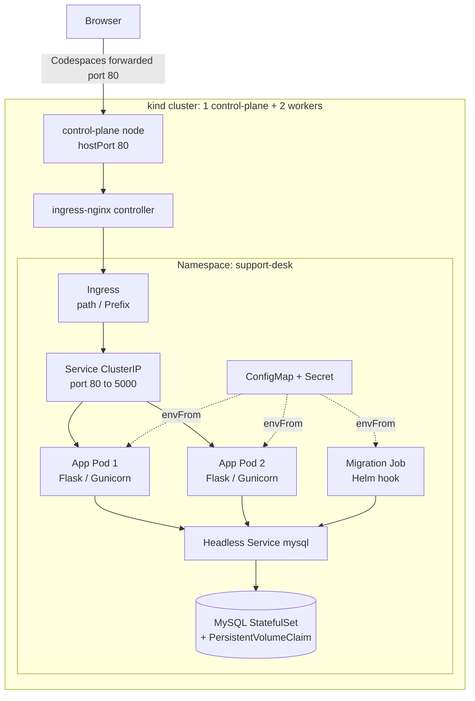

<a href="https://www.linkedin.com/in/vincent-lucas-483b29295/" target="_blank">LinkedIn</a>

# Highly Available Support Desk on AWS

A production-style support ticket web application deployed on AWS with Docker, Terraform, Amazon ECS Fargate, an Application Load Balancer, and Amazon RDS for MySQL. The same application is also packaged as a Helm chart and runs on a local multi-node Kubernetes cluster (kind).

This project was built as a hands-on Cloud Engineering exercise: develop and test a Python application locally, package it into a Docker image, provision modular AWS infrastructure with Terraform, deploy two application tasks on ECS Fargate, validate end-to-end persistence in MySQL, inspect CloudWatch logs, and destroy the environment after validation. It was then extended with a [Kubernetes deployment](#kubernetes-deployment-local-kind--helm) of the same application, described in its own section below.

> The AWS infrastructure is intentionally destroyed after validation to avoid unnecessary costs. The repository keeps the complete application source code, automated tests, Docker configuration, Terraform modules, Helm chart, and deployment evidence so the environment can be recreated.

| Deployment target | Status |
|---|---|
| AWS: ECS Fargate + ALB + RDS (Terraform) | Deployed, validated, then destroyed |
| Kubernetes: local kind cluster (Helm) | Running and validated locally |
| Kubernetes: Amazon EKS | Not built yet (see [Possible next steps](#possible-next-steps)) |

## What it does

The Support Desk provides a simple ticket workflow.

- Create a ticket with an author, title, and description.
- Store tickets in Amazon RDS for MySQL.
- Display submitted tickets in the web interface.
- Keep tickets available after a page refresh.
- Expose a `/health` endpoint for load balancer health checks.

Each ticket includes:

```text
id
author
title
description
status
created_at
```

## Architecture

```text
User
  |
  v
Application Load Balancer
  |
  v
ECS Service
  |
  +--> Fargate task 1
  |
  +--> Fargate task 2
  |
  v
RDS MySQL
```



## Technologies

| Technology | Purpose |
|---|---|
| Amazon VPC | Provides isolated networking with public and private subnets. |
| NAT Gateway | Provides outbound internet access for private subnets (provisioned for private workloads; the current Fargate tasks use public IPs instead). |
| Application Load Balancer | Public entry point that routes traffic to healthy application tasks. |
| Amazon ECS | Orchestrates the containerized Support Desk service. |
| AWS Fargate | Runs containers without managing EC2 instances. |
| Amazon RDS for MySQL | Stores persistent ticket data. |
| Amazon CloudWatch Logs | Collects application and container logs. |
| AWS Security Groups | Restrict traffic between the load balancer, ECS tasks, and database. |
| Terraform | Provisions infrastructure through reusable modules. |
| Docker and Docker Compose | Package and run the application consistently in local and cloud environments. |
| Python / Flask | Implements the Support Desk application. |
| Gunicorn | Runs the Flask application in the container. |
| Pytest | Tests the health endpoint, application rendering, and ticket workflow. |
| Kubernetes (kind) | Local multi-node cluster running the same application image. |
| Helm | Packages every Kubernetes resource of the application as one parameterised chart. |
| ingress-nginx | Ingress controller exposing the application on the local cluster. |

## Network and security

The architecture separates public access, application compute, and persistent data.

| Source | Destination | Port | Purpose |
|---|---|---:|---|
| Internet | Application Load Balancer | 80 | Public HTTP access. |
| ALB security group | ECS task security group | 5000 | Forwards requests to the Flask application. |
| ECS task security group | RDS security group | 3306 | Allows MySQL access only from the application tier. |

The Fargate tasks run in public subnets with public IPs so they can pull the image from Docker Hub, but their security group only accepts port `5000` from the ALB security group, so they cannot be reached directly from the internet. RDS sits in private subnets and only accepts MySQL traffic from the application security group. Moving the tasks to private subnets behind the NAT Gateway is listed in the next steps.

## Engineering decisions

### Modular Terraform

Infrastructure is split into focused modules for networking, security, load balancing, ECS, database, and compute configuration. This improves readability, reuse, and maintenance compared with placing every resource in one Terraform file.

### Containerized Python application

The Flask application is packaged with Docker. The same container definition supports local development through Docker Compose and cloud deployment through ECS Fargate.

### Two application tasks behind an ALB

The ECS service maintains two running Fargate tasks. The ALB distributes incoming requests only to targets that pass the configured health checks.

### Health endpoint

The application exposes `/health`, allowing the ALB to check task availability independently of the user-facing ticket page.

### Persistent MySQL storage

Ticket creation writes data to RDS MySQL, while the application reads existing tickets back from the database. Data therefore persists independently from the lifecycle of individual containers.

### Centralized application logs

The application emits operational logs to CloudWatch, including successful health checks and ticket creation events.

### Testable application behavior

The repository contains Pytest tests for the health endpoint, page behavior, and ticket workflow. This gives the application a local verification layer before deployment.

## Project structure

```text
.
├── app/
│   ├── app.py                         # Flask routes and ticket workflow
│   ├── db.py                          # Database connection and query helpers
│   ├── migrate.py                     # Database migration runner
│   ├── requirements.txt               # Python dependencies
│   ├── Dockerfile                     # Application container definition
│   ├── docker-compose.yml             # Local application and database environment
│   ├── db/
│   │   └── 001_create_tickets.sql     # MySQL tickets table schema
│   ├── templates/
│   │   └── index.html                 # Support Desk interface
│   └── test/
│       ├── test_health.py             # Health endpoint tests
│       ├── test_index.py              # Index page tests
│       └── test_tickets.py            # Ticket workflow tests
├── terraform/
│   ├── main.tf                        # Root module composition
│   ├── providers.tf                   # Terraform and AWS provider configuration
│   ├── variables.tf                   # Root input variables
│   ├── outputs.tf                     # Infrastructure outputs
│   ├── terraform.tfvars.example       # Example variable values
│   ├── .terraform.lock.hcl            # Locked provider versions
│   └── modules/
│       ├── network/                   # VPC, subnets, routes, NAT Gateway
│       ├── security/                  # ALB, ECS, and RDS security groups
│       ├── load_balancer/             # ALB, listener, target group, health checks
│       ├── ecs/                       # ECS cluster, task definition, service
│       └── database/                  # RDS MySQL and database subnet group
├── helm/support-desk/                 # Helm chart for the Kubernetes deployment
│   ├── Chart.yaml
│   ├── values.yaml                    # Defaults (local kind cluster)
│   ├── values-local.yaml              # Local overlay (fake credentials only)
│   ├── values-eks.yaml                # EKS overlay sketch (not validated yet)
│   └── templates/                     # Deployment, Service, ConfigMap, Secret, Ingress,
│                                      # MySQL StatefulSet, migration Job (Helm hook)
├── k8s/local/
│   └── kind-config.yaml               # kind cluster: 1 control-plane + 2 workers
├── resources/
│   ├── ecs-service-healthy.png
│   ├── alb-targets-healthy.png
│   ├── ticket-creation.png
│   ├── ticket_open.png
│   ├── cloudwatch-logs.png
│   └── terraform-plan-terminal.png
├── .devcontainer/
│   ├── Dockerfile
│   └── devcontainer.json
├── LICENSE
└── README.md
```

## Run locally

### Prerequisites

- Docker and Docker Compose
- Python 3.12 or newer
- Terraform
- AWS CLI configured for the target AWS account

Start the local application stack:

```bash
cd app
docker compose up --build
```

Open the application:

```text
http://localhost:5000
```

Stop the local stack:

```bash
docker compose down
```

## Run tests

From the repository root, activate your Python environment and install dependencies:

```bash
python -m pip install -r app/requirements.txt
```

Run the test suite:

```bash
python -m pytest app/test -v
```

## Deploy with Terraform

Create your local Terraform variables file from the tracked example:

```bash
cd terraform
cp terraform.tfvars.example terraform.tfvars
```

Update `terraform.tfvars` with the values required for your AWS deployment. Do not commit this file if it contains sensitive values.

Initialize and validate the configuration:

```bash
terraform init
terraform fmt -recursive
terraform validate
terraform plan
```

Deploy the infrastructure:

```bash
terraform apply
```

After a successful deployment, Terraform outputs the information needed to access the application.

## Validation evidence

### ECS service is stable

The ECS service is active with a desired count of two tasks, two tasks running, no pending tasks, and a successful deployment.


### ALB routes to healthy tasks

The ALB target group reports two healthy IP targets on port `5000`, confirming that both Fargate tasks pass the health checks.


### Ticket creation through the ALB

The application is reachable through the public load balancer and accepts ticket submissions through its web interface.


### Ticket data persists in MySQL

A submitted ticket remains visible after refreshing the page, demonstrating a successful write and read through RDS MySQL.


### Centralized CloudWatch logs

CloudWatch records ALB health checks and application-level ticket creation events.


### Terraform convergence

After deployment, Terraform reports no changes, confirming that the deployed AWS resources match the declared configuration.


## Cleanup

The deployed stack includes chargeable AWS resources, including Fargate tasks, an ALB, an RDS instance, and a NAT Gateway.

Destroy all resources tracked by Terraform:

```bash
cd terraform
terraform plan -destroy
terraform destroy
```

Review the destruction plan before confirming. The application code, Docker configuration, Terraform modules, tests, and validation evidence remain in the repository and can recreate the environment later.

## Kubernetes deployment (local, kind + Helm)

The same application image runs on a local Kubernetes cluster created with [kind](https://kind.sigs.k8s.io/) (Kubernetes in Docker), and every Kubernetes resource is packaged in a single Helm chart: `helm/support-desk`. Everything was built and tested inside a GitHub Codespace (2 vCPU / 8 GB) using the repository's devcontainer, which provides Docker-in-Docker, kind, kubectl and Helm.

### Architecture



### ECS to Kubernetes mapping

| ECS / AWS version | Kubernetes version | Difference worth knowing |
|---|---|---|
| ECS service, desired count 2 | Deployment, `replicas: 2` (via a ReplicaSet) | The reconciliation loop is visible (`kubectl get rs`) and keeps a revision history for rollbacks. |
| Task definition | Pod template inside the Deployment | Changing the template (e.g. the image tag) triggers a rolling update. |
| ALB target group + health check | Service + `readinessProbe` | A failing readiness probe removes the Pod from the Service; only a failing `livenessProbe` restarts it. |
| ALB + listener rule | Ingress + ingress-nginx controller | The Ingress is only a routing rule; the controller is the component that actually proxies traffic. |
| Task definition environment | ConfigMap (host, port, database name) + Secret (credentials) | Secrets are only base64-encoded, not encrypted by default. |
| Task CPU / memory (256 / 512) | `requests` 128m / 256Mi, `limits` 256m / 512Mi | Requests drive scheduling; exceeding the memory limit gets the container OOM-killed, while exceeding the CPU limit only throttles it. |
| Amazon RDS | MySQL StatefulSet + PersistentVolumeClaim | Local stand-in only. A cloud deployment would keep a managed database. |
| Manual schema creation | Migration Job run as a Helm hook | Database migration is now part of every install and upgrade. |
| Terraform modules + tfvars | Helm chart + values files | Each `helm install`/`upgrade` creates a numbered release revision that `helm rollback` can return to. |

### Helm chart

| File | Role |
|---|---|
| `values.yaml` | Defaults for the local cluster: 2 replicas, image `support-desk:dev` with `pullPolicy: Never`, probes on `/health:5000`, resources, in-cluster MySQL enabled. |
| `values-local.yaml` | Fake local credentials only (the same ones as `docker-compose.yml`). |
| `values-eks.yaml` | Sketch of the EKS differences (external database, `alb` ingress class). Not validated. Real credentials must be passed with `--set` at install time, never committed. |
| `templates/mysql-*.yaml` | Rendered only when `mysql.enabled` is true (`{{- if }}`), so a cloud install would deploy no database Pod. |
| `templates/migrate-job.yaml` | Runs `python migrate.py` (idempotent `CREATE TABLE IF NOT EXISTS`) as a `post-install,pre-upgrade` hook. |

### Run it

Prerequisites: Docker, kind, kubectl and Helm (all provided by the devcontainer).

1. Create the cluster (1 control-plane + 2 workers, port 80 mapped on the control-plane node):

   ```bash
   kind create cluster --config k8s/local/kind-config.yaml
   kubectl get nodes
   ```

2. Build the image and load it into every kind node (no registry involved):

   ```bash
   docker build -t support-desk:dev app
   kind load docker-image support-desk:dev --name support-desk
   ```

3. Install the ingress-nginx controller and pin it to the control-plane node, where port 80 is mapped:

   ```bash
   kubectl apply -f https://raw.githubusercontent.com/kubernetes/ingress-nginx/main/deploy/static/provider/kind/deploy.yaml
   kubectl patch deployment ingress-nginx-controller -n ingress-nginx \
     -p '{"spec":{"template":{"spec":{"nodeSelector":{"kubernetes.io/os":"linux","ingress-ready":"true"}}}}}'
   kubectl rollout status deployment/ingress-nginx-controller -n ingress-nginx
   ```

4. Install the application:

   ```bash
   helm install support-desk helm/support-desk \
     -f helm/support-desk/values-local.yaml \
     --namespace support-desk --create-namespace
   kubectl get all -n support-desk
   ```

5. Open the application: `http://localhost` on a local machine, or the forwarded port 80 URL (`https://<codespace>-80.app.github.dev`) in the Codespaces **Ports** tab.

### Validation performed

These checks were run by hand on the kind cluster:

- **Self-healing**: deleting an application Pod makes the ReplicaSet create a replacement within seconds. Deleting a bare Pod (no controller) does not.
- **Scheduling**: the two application replicas are spread across both worker nodes, and none runs on the control-plane (its `NoSchedule` taint).
- **Service discovery**: a throwaway Pod reaches the application at `http://support-desk/health` through cluster DNS.
- **Rolling update**: changing the Pod template (adding probes, resources and DB configuration) replaced the Pods with no downtime. New Pods received traffic only after their readiness probe passed.
- **Persistence**: tickets created through the Service survived deleting both application Pods at once, because the data lives in MySQL's PersistentVolumeClaim.
- **One-command install**: deleting the whole namespace and running `helm install` once recreated MySQL, the application, the Service and the Ingress, and ran the migration hook to completion (`STATUS: deployed`).
- **Ingress**: the application is reachable in a browser through ingress-nginx on port 80.

### Issues found and fixed

These showed up only when deploying for real. `helm lint` and `helm template` did not catch any of them.

- **Ingress controller on the wrong node.** The upstream kind manifest for ingress-nginx only selects `kubernetes.io/os: linux`. The controller landed on a worker, while port 80 is mapped on the control-plane node, so requests got an empty response. Found with `docker port` and `kubectl get pods -o wide`, then fixed by patching the `nodeSelector` (step 3 above).
- **Migration hook timing.** A `pre-install` hook runs before any regular resource of the release exists, including the in-cluster MySQL and the ConfigMap/Secret the Job reads. The hook failed with `configmap "support-desk-config" not found`. It now runs as `post-install,pre-upgrade`.
- **Database cold start.** On a fresh volume, MySQL needs about 45 seconds before it accepts connections. Two retries ran out before that. `backoffLimit: 4` covers the window thanks to the exponential retry delay. `hook-delete-policy: before-hook-creation` removes a failed previous run so it never blocks the next install.
- **Template delimiters inside comments.** Helm renders a file as a Go template before parsing it as YAML, so `{{ }}` inside a `#` comment is still evaluated and can break the chart.
- **No ordering between resources.** Applying all manifests at once started the migration before MySQL was ready. Kubernetes has no equivalent of Terraform's `depends_on`; each workload has to tolerate dependencies that are not ready yet (retries, readiness probes).

### Current limitations

- Validated on a local kind cluster only. No managed Kubernetes cluster (EKS) has been provisioned.
- The in-cluster MySQL is a single replica on a local volume, for development only.
- Kubernetes Secrets are base64-encoded, not encrypted. The local chart only contains fake credentials.
- No NetworkPolicy yet: any Pod in the cluster can reach MySQL on port 3306.
- No screenshots were captured for this part. The checks above were run by hand from the terminal.

### Cleanup

```bash
helm uninstall support-desk -n support-desk
kubectl delete namespace support-desk   # also removes the MySQL PersistentVolumeClaim
kind delete cluster --name support-desk
```

## Skills demonstrated

- Infrastructure as Code with modular Terraform.
- Docker image creation and local orchestration with Docker Compose.
- Python and Flask web application development.
- Automated testing with Pytest.
- AWS networking with VPCs, public/private subnets, routing, NAT Gateway, and security groups.
- Container orchestration with Amazon ECS and AWS Fargate.
- Application Load Balancer configuration, target groups, and health checks.
- Amazon RDS MySQL integration and persistent application data.
- CloudWatch Logs for operational visibility.
- Deployment validation through ECS service status, target health, application behavior, logs, and Terraform convergence.
- Cost-aware infrastructure cleanup with Terraform.
- Kubernetes fundamentals on a multi-node kind cluster: Deployments, ReplicaSets, Services and cluster DNS, Namespaces, ConfigMaps and Secrets, StatefulSets with PersistentVolumeClaims, Jobs, readiness/liveness probes, resource requests/limits, rolling updates.
- Ingress with the ingress-nginx controller.
- Helm chart authoring: Go templating, values overlays per environment, conditional resources, release hooks for database migration.
- Troubleshooting Kubernetes workloads with `describe`, `logs`, events and endpoints.

## Possible next steps

- Deploy the Helm chart on Amazon EKS: a Terraform root reusing the `network` and `database` modules, a managed node group in private subnets, ECR images tagged with the Git SHA, and the AWS Load Balancer Controller (IAM through EKS Pod Identity) creating the ALB from the Ingress.
- Add Kubernetes NetworkPolicies (only the ingress controller reaches the application; only the application reaches MySQL).
- Add a HorizontalPodAutoscaler with metrics-server.
- Run the Fargate tasks in private subnets behind the NAT Gateway.
- Store database credentials in AWS Secrets Manager.
- Move the application image from Docker Hub to Amazon ECR.
- Add HTTPS with AWS Certificate Manager and an ALB HTTPS listener.
- Add ECS Service Auto Scaling based on CPU, memory, or ALB request count.
- Configure RDS Multi-AZ, backups, and monitoring.
- Add GitHub Actions for Pytest, Docker builds, Terraform formatting, validation, and deployment.
- Use an S3 remote Terraform backend with DynamoDB state locking.
- Add CloudWatch alarms and dashboards.
- Add authentication, authorization, and AWS WAF protection.

## Contact

- LinkedIn: [Vincent Lucas](https://www.linkedin.com/in/vincent-lucas-483b29295/)
- GitHub: [@vinsl](https://github.com/vinsl)
- Email: [vincentselucas@gmail.com](mailto:vincentselucas@gmail.com)